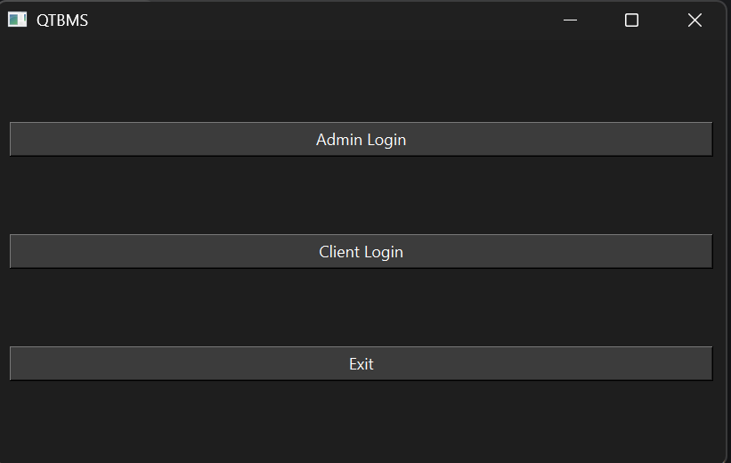
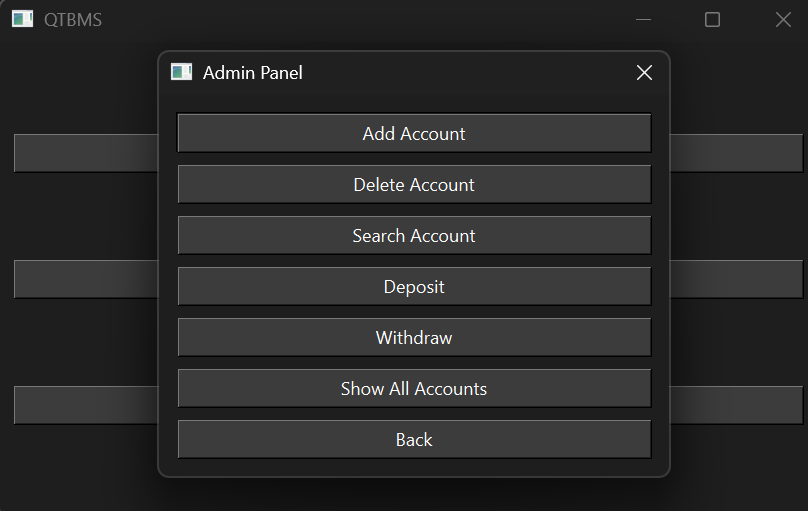

# 🏦 Bank Management System (QTBMS)

A simple and interactive Bank Management System built with **C++** and the **Qt6 Framework**. This application supports two types of users: **Admin** and **Client**. Admins can manage all bank accounts, while clients can view their own account details via a user-friendly GUI.

---

## 📸 Screenshots

### Login Interface


### Admin Dashboard


---

## 🚀 Features

- 🧑‍💼 Dual login system (Admin & Client)
- ➕ Add/Delete/Search account operations
- 💰 Deposit and Withdraw funds
- 👁️ View individual or all accounts
- 🧩 Built with Object-Oriented Design
- 🖼️ GUI using Qt (QMainWindow, QDialog, QPushButton, etc.)
- ⚙️ CMake-based build system

---

## 🧠 Data Structures & Algorithms Used

- **Singly Linked List**: To store account data
- **Encapsulation**: All account logic handled by `BankAccount` class
- **Linear Search**: For finding and managing accounts
- **Dynamic Memory Management**: Using `new` and `delete`
- **Modular OOP Design**: Classes and dialogs for maintainability

---

## 🛠️ Build Instructions

### 🧰 Prerequisites

- C++ compiler (MinGW, MSVC, or Clang)
- [Qt6](https://www.qt.io/)
- [CMake](https://cmake.org/)

### 🔧 Build Steps

```bash
git clone https://github.com/yourusername/QTBMS.git
cd QTBMS
cmake .
make
./QTBMS
```

> 💡 You can also open the project with **Qt Creator** for a GUI-based development environment.

---

## 📁 Project Structure

```
QTBMS/
├── main.cpp
├── mainwindow.cpp/h
├── admindialog.cpp/h
├── clientdialog.cpp/h
├── banklogic.cpp/h
├── CMakeLists.txt
└── README.md
```

---

## 📜 License

This project is licensed under the MIT License.

---

## 🙋‍♂️ Author

**Hritik G Bishnoi**

> Contributions, ideas, or improvements are welcome!
